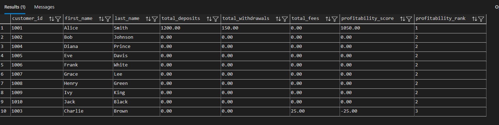
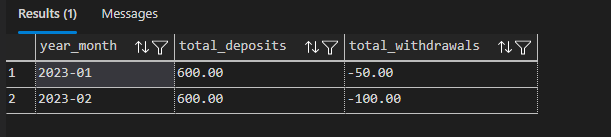

# SQL Banking Customer Behavior & Profitability Analysis

## 📌 Project Title: SQL Banking Customer Behavior & Profitability Analysis

## 🧠 Problem Overview

This project addresses a critical challenge for a retail bank: **optimizing customer engagement and improving profitability**. The bank needs to derive actionable insights from its transactional and customer data to understand customer behavior, identify high-value segments, and assess factors influencing account and loan outcomes.

As a Data Analyst, my goal was to leverage SQL to analyze customer behavior, identify key financial trends, and assess customer profitability, ultimately providing data-driven insights for strategic decision-making.

## 🗃️ Dataset Description

This project utilizes a simulated banking dataset (`BankDB`), which was set up with the following tables:

* **`Customers`**: Stores customer demographic information (ID, Name, Email, Address, DOB, Registration Date).
* **`Accounts`**: Contains details about bank accounts (ID, Customer ID, Type, Balance, Open Date, Status, Interest Rate).
* **`Transactions`**: Records all financial transactions (ID, Account ID, Date, Amount, Type, Description).
* **`Loans`**: Provides specific details for loan accounts (ID, Account ID, Loan Amount, Interest Rate, Status).
* **`Branches`**: Information about bank branches (ID, Name, Address, Manager).

The dataset was initially populated with sample data and refined through initial cleaning exercises during the training program.

## 🛠️ Tools & Skills Demonstrated

This project showcases mastery of a wide range of SQL concepts and practical data analysis skills using **Microsoft SQL Server Management Studio (SSMS)**:

* **Data Retrieval**: `SELECT`, `SELECT DISTINCT`, `WHERE`, `TOP`, `ORDER BY`.
* **Data Manipulation**: `INSERT`, `UPDATE`, `DELETE` (conceptual application).
* **Data Aggregation**: `COUNT`, `SUM`, `AVG`, `MIN`, `MAX` with `GROUP BY` and `HAVING`.
* **Conditional Logic**: `CASE WHEN` statements for data categorization.
* **Complex JOINs**: `INNER JOIN`, `LEFT JOIN`, `RIGHT JOIN`, `FULL OUTER JOIN` for combining data from multiple tables.
* **Set Operators**: `UNION`, `INTERSECT`, `EXCEPT` for combining query results.
* **Subqueries**: Using nested queries (`IN`, `EXISTS`, scalar subqueries) for advanced filtering and calculations.
* **Database Objects**: Creating and querying `VIEWS` for simplified data access and reporting.
* **String Functions**: `LEN`, `UPPER`, `LOWER`, `REPLACE`, `TRIM`, `CONCAT`, `SUBSTRING` for text manipulation.
* **Mathematical Functions**: `CEILING`, `FLOOR`, `ROUND`, `POWER` for numerical operations.
* **Date/Time Functions**: `GETDATE()`, `DATEPART`, `DATENAME`, `DATEDIFF` for temporal analysis.
* **Pattern Matching**: `LIKE` operator with wildcards (`%`, `_`) for flexible text searching.
* **Window Functions**: `ROW_NUMBER()`, `RANK()`, `DENSE_RANK()`, `LAG()`, `LEAD()`, `SUM() OVER()` for advanced analytical calculations over partitions of data.
* **Problem-Solving**: Translating real-world business questions into effective SQL queries.

## 📊 Key Business Questions Answered

This project provides insights into:

* Overall customer portfolio size and value.
* Transaction patterns and trends over time.
* Identification of high-value and potentially at-risk customer segments.
* Performance overview of loan portfolios.
* Key metrics for customer engagement and profitability.

## 🚀 How to Run the SQL Scripts

1.  **Open SSMS**: Launch SQL Server Management Studio.
2.  **Connect to Server**: Connect to your SQL Server instance.
3.  **Create Database & Tables**: Open a new query window and execute the `Sample Banking Dataset (SQL Server)` script provided in the training. This will set up your `BankDB` and populate it with data.
4.  **Execute Project Script**: Open the `banking_analytics_project.sql` file (your solution script for this project).
5.  **Run Queries**: Execute the queries section by section, observing the results for each task.

## 📷 Sample Screenshots (Optional - Placeholder)


### Example Query Script: Customer Profitability Ranking
```SELECT 
    c.customer_id,
    c.first_name,
    c.last_name,
    COALESCE(SUM(CASE WHEN t.transaction_type = 'Deposit' THEN t.amount ELSE 0 END), 0) AS total_deposits, --summing deposit amount from transactions table
    COALESCE(SUM(CASE WHEN t.transaction_type = 'Withdrawal' THEN ABS(t.amount) ELSE 0 END), 0) AS total_withdrawals, --summing withdrawal amount from transactions table
    COALESCE(SUM(CASE WHEN t.transaction_type = 'Fee' THEN ABS(t.amount) ELSE 0 END), 0) AS total_fees, --summing fee amount from transactions table
    
     --calculating profitability score by subtracting total withdrawals and total fees from total deposits
    COALESCE(SUM(CASE WHEN t.transaction_type = 'Deposit' THEN t.amount ELSE 0 END), 0) -- total deposits
    - COALESCE(SUM(CASE WHEN t.transaction_type = 'Withdrawal' THEN ABS(t.amount) ELSE 0 END), 0) -- total withdrawals
    - COALESCE(SUM(CASE WHEN t.transaction_type = 'Fee' THEN ABS(t.amount) ELSE 0 END), 0) AS profitability_score, --profitability score
    --ranking customers based on profitability score using RANK() function
    DENSE_RANK() OVER (ORDER BY 
        COALESCE(SUM(CASE WHEN t.transaction_type = 'Deposit' THEN t.amount ELSE 0 END), 0)
      - COALESCE(SUM(CASE WHEN t.transaction_type = 'Withdrawal' THEN ABS(t.amount ) ELSE 0 END), 0) 
      - COALESCE(SUM(CASE WHEN t.transaction_type = 'Fee' THEN ABS(t.amount) ELSE 0 END), 0) DESC
    ) AS profitability_rank
FROM Customers c --selecting from customers table
LEFT JOIN Accounts a ON c.customer_id = a.customer_id --joining accounts table to customers table on customer id column
LEFT JOIN Transactions t ON a.account_id = t.account_id --joining transactions table to accounts table on account id column
GROUP BY c.customer_id, c.first_name, c.last_name --grouping by customer id, first name and last name
ORDER BY profitability_rank; --ordering by profitability rank
```

### Example Query Output: Customer Profitability Ranking


### Example Query Script: Monthly Transaction Summary View
```DROP VIEW IF EXISTS vw_MonthlyTransactionSummary;
GO

CREATE VIEW vw_MonthlyTransactionSummary AS ---creating view named vw_MonthlyTransactionSummary
SELECT  
    FORMAT(transaction_date, 'yyyy-MM') AS year_month, --formatting transaction date to year and month
    SUM(CASE WHEN transaction_type = 'Deposit' THEN amount ELSE 0 END) AS total_deposits, --summing deposit amount from transactions table
    SUM(CASE WHEN transaction_type = 'Withdrawal' THEN amount ELSE 0 END) AS total_withdrawals --summing withdrawal amount from transactions table
FROM Transactions --selecting from transactions table
GROUP BY FORMAT(transaction_date, 'yyyy-MM'); --grouping by year and month


GO 
select * from vw_MonthlyTransactionSummary;
```


### Example Query Output: Monthly Transaction Summary View


## ✍️ Reflection / Next Steps

* **Challenges Faced**: Major SQL challenges I encountered are complex joins, debugging window functions (Rank), optimizing query performance and I was able to resolve them through deep research and the use of coding agent on visual studio code
* **Key Insights Derived**: "Customers with both Checking and Savings accounts show significantly higher average balances," and "Loan payments consistently represent the largest transaction type by volume."
* **Future Enhancements**:
    * **Data Visualization**: Export of the results of your key analytical queries (e.g., customer profitability, monthly transaction summaries) to Power BI to create interactive dashboards.
    * **Performance Optimization**: Explore creating `NONCLUSTERED INDEXES` on columns frequently used in `WHERE` clauses, `JOIN` conditions, or `ORDER BY` clauses, and analyze their impact on query execution plans.
    * **Stored Procedures**: Create stored procedures for frequently run reports (e.g., a procedure to get customer details and their latest transactions for a given customer ID).
    * **More Advanced Analytics**: Implement more complex customer segmentation (e.g., RFM analysis) or churn prediction using SQL.
    * **Data Quality Checks**: Write SQL queries to identify and report on potential data quality issues that might still exist (e.g., negative transaction amounts for deposits).

---
